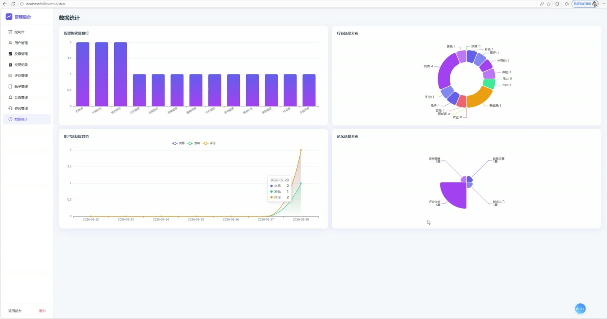
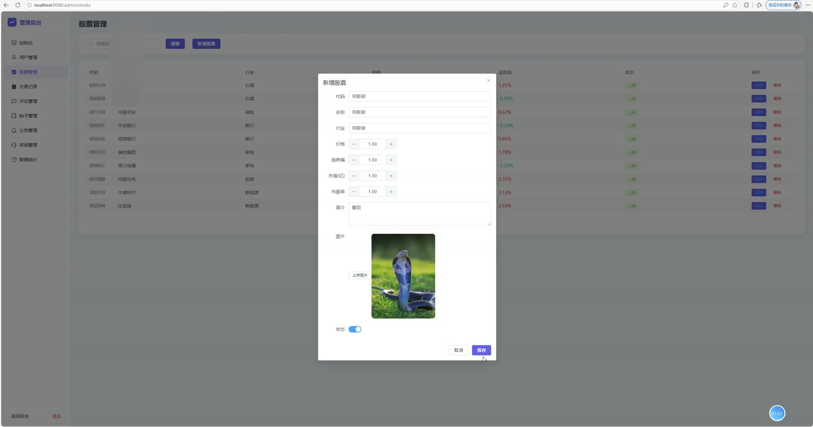
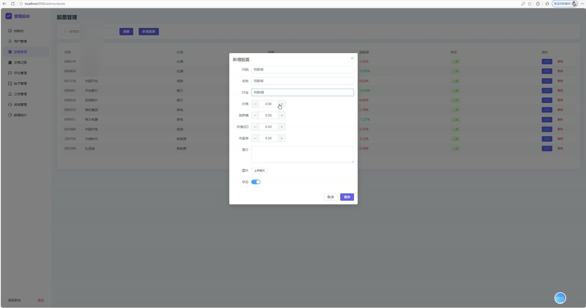
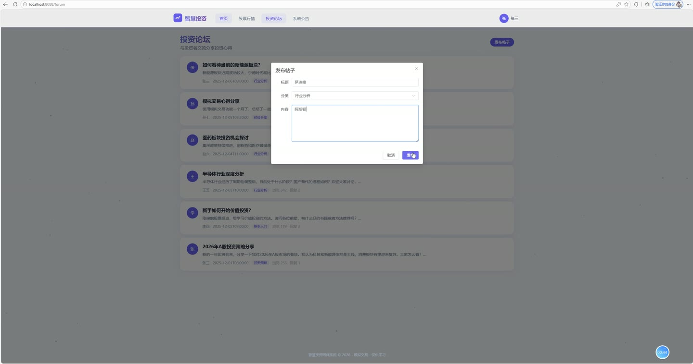
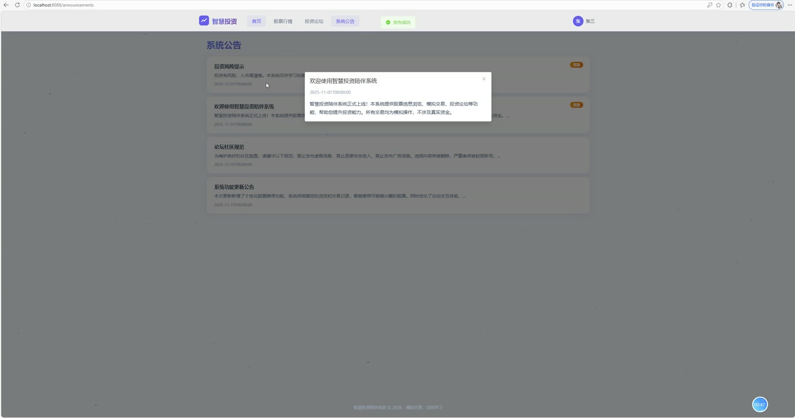
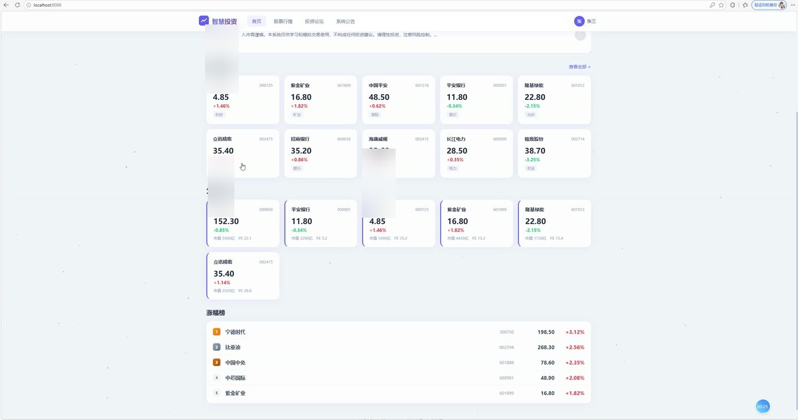

# (附文档)Springboot3+Vue3+MySQL 智慧投资陪伴系统

**技术栈**：Springboot3、Vue3、MySQL

### 系统简介

智慧投资陪伴系统是一套基于 SpringBoot3 + Vue3 + MySQL 的前后端分离架构的投资信息服务平台。系统包含普通用户端与管理员端两大角色，提供股票行情浏览、模拟交易、投资社区、专家咨询、公告管理、数据统计等核心服务。系统内置 JWT 身份认证与 BCrypt 密码加密机制，保障数据访问安全。
 
### 核心功能
 
### 普通用户端

 
- 用户注册与登录：通过用户名和密码完成身份认证，登录成功后签发 JWT Token，支持自动填充昵称、头像、邮箱、手机号等个人资料。 
- 个人中心：查看当前登录用户的基本信息（用户名、昵称、头像、邮箱、手机号、角色、状态），通过 Authorization 请求头解析 Token 获取用户详情。 
- 股票行情浏览：分页查看股票列表，支持按关键词（股票名称/代码）模糊搜索、按行业筛选、按涨跌幅/市值排序，字段包含现价、涨跌幅、市值、成交量、换手率、市盈率。 
- 股票行业分类：获取所有在售股票所属行业列表，用于前端筛选下拉框数据源。 
- 股票详情查看：查看单只股票完整信息（含股票代码、名称、行业、现价、涨跌幅、市值、成交量、换手率、市盈率、描述、图片），每次访问自动记录浏览历史并累加浏览次数。 
- 股票评论互动：查看某只股票下的全部已通过评论（含评论人昵称、头像、内容、时间），登录用户可发表评论，评论内容即时展示。 
- 智能股票推荐：根据用户历史浏览股票的行业偏好，推荐同行业未浏览股票；无浏览记录时返回热门股票（按成交量排序），不足6条时补充热门股票。 
- 模拟交易（买入）：选择股票并输入数量，系统按当前价格自动计算总金额并生成买入交易记录，记录包含股票代码、名称、价格、数量、总金额。 
- 模拟交易（卖出）：选择股票并输入数量，系统按当前价格自动计算总金额并生成卖出交易记录，记录包含股票代码、名称、价格、数量、总金额。 
- 交易记录查询：查看当前用户全部交易记录（买入/卖出），按时间倒序排列，展示股票名称、交易类型、价格、数量、总金额、成交时间。 
- 投资论坛发帖：发布投资相关帖子，填写标题、内容、分类（如技术分析、基本面、行业讨论等），发布后浏览量、回复数初始为0。 
- 论坛帖子浏览：查看全部已发布帖子（含发帖人昵称、头像），支持查看帖子详情，每次访问自动增加浏览量。 
- 论坛回复互动：对感兴趣的帖子发表回复，回复成功后帖子回复数自动+1，回复按时间正序排列展示。 
- 公告查看：查看系统发布的全部启用公告，置顶公告优先展示，公告包含标题、内容、图片、发布时间。 
- 投资咨询提交：填写咨询标题和内容，提交后状态为待回复，可在"我的咨询"中查看历史咨询及管理员回复。 
- 我的咨询列表：查看当前用户提交的全部咨询记录（含标题、内容、回复内容、回复时间、状态），按提交时间倒序排列。 
- 热门股票速览：首页展示成交量最高的10只股票，涨跌幅前5的股票，以及最新5条公告，无需登录即可访问。 
- 个人仪表盘：登录后进入个人工作台，汇总展示个人交易记录与投资动态。
 
### 管理员端

 
- 控制台数据概览：统计并展示平台用户总数、股票总数、交易总笔数、帖子总数，以卡片形式呈现核心运营指标。 
- 股票购买排行图表：统计各股票买入次数生成柱状图，直观展示热门股票交易热度。 
- 行业热度分布图表：按股票所属行业聚合买入次数生成饼图，分析行业投资热度分布。 
- 用户活跃度趋势：统计最近7天每日交易数、发帖数、评论数，以折线图展示平台活跃趋势。 
- 论坛分类趋势统计：按帖子分类统计发帖数量生成饼图，了解社区讨论热点分布。 
- 用户管理：分页查看用户列表，支持按用户名/昵称模糊搜索，展示用户注册时间，支持启用/禁用用户账号。 
- 股票管理：分页查看股票列表，支持按名称/代码搜索；新增股票（设置代码、名称、行业、现价、涨跌幅、市值、成交量、换手率、市盈率、描述、图片）；编辑股票信息；删除股票。 
- 交易记录管理：分页查看全平台所有用户的交易记录（含用户昵称），按时间倒序展示，便于运营审计。 
- 评论管理：查看全平台股票评论列表（含评论用户昵称、对应股票名称、内容、时间），支持隐藏/显示评论、删除违规评论。 
- 论坛帖子管理：查看全平台帖子列表（含发帖人信息），支持隐藏/显示帖子、删除违规帖子。 
- 公告管理：发布新公告（标题、内容、图片、置顶开关、状态开关）；编辑已有公告；删除公告；公告列表按置顶优先、时间倒序排列。 
- 咨询管理：查看用户提交的全部投资咨询（含用户昵称、标题、内容、状态、提交时间），对待回复咨询进行回复，回复后状态自动变为已回复并记录回复时间。
 
### 技术栈

  后端框架 Spring Boot 3   ORM框架 MyBatis-Plus（含分页插件、逻辑删除、字段自动填充）   权限认证 Spring Security + JWT（jjwt 0.12.x）   密码加密 BCryptPasswordEncoder   前端框架 Vue 3（Composition API + script setup）   前端路由 Vue Router 4（history 模式 + 路由守卫）   状态管理 Pinia（用户登录态管理）   UI组件库 Element Plus   图表库 ECharts   构建工具 Vite   数据库 MySQL 8.x（数据库名：smart_invest）   文件上传 本地存储（MultipartFile + UUID 文件名） 
 
### 交付内容

 
- 后端完整源码 
- 前端完整源码 
- 数据库初始化脚本 
- 万字文档

## 界面展示

---

## 获取完整源码 + 万字文档

本仓库为项目介绍页。**完整前后端源码、数据库初始化脚本、万字项目文档**，请加微信 `kangkangcode`，或访问 [codekk.top](http://codekk.top) 获取。

可作课程设计 / 毕业设计参考，支持远程部署调试。